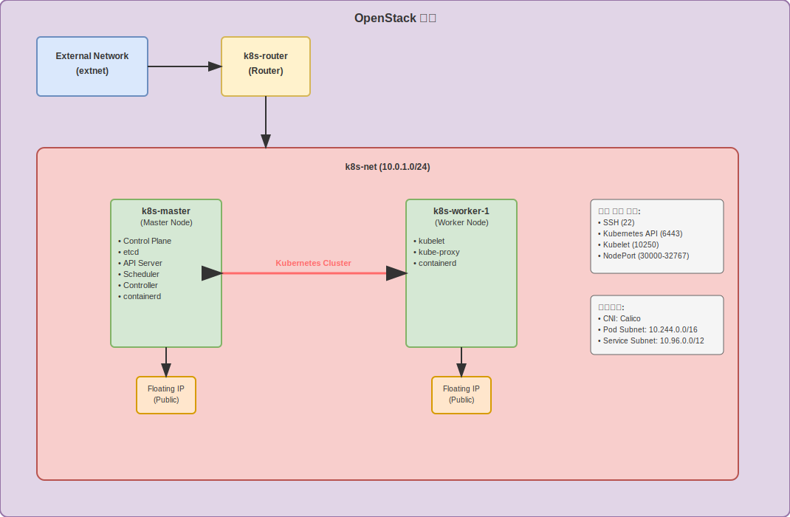

# OpenStack 기반 Kubernetes 클러스터 자동 배포

이 프로젝트는 OpenStack 환경에서 Terraform과 Ansible을 사용하여 Kubernetes 클러스터를 자동으로 배포하는 Infrastructure as Code(IaC) 솔루션입니다.

## 프로젝트 개요

OpenStack 클라우드 환경에서 완전히 자동화된 Kubernetes 클러스터를 구축합니다. Terraform으로 인프라를 프로비저닝하고, Ansible로 Kubernetes 클러스터를 설정 및 구성합니다.

## 아키텍처



## 주요 기능

- **완전 자동화**: 단일 스크립트 실행으로 전체 클러스터 배포
- **Infrastructure as Code**: Terraform을 통한 인프라 관리
- **Configuration Management**: Ansible을 통한 자동화된 설정
- **확장 가능**: 워커 노드 수량 조정 가능
- **보안**: SSH 키 기반 인증 및 적절한 보안 그룹 설정
- **네트워킹**: Calico CNI를 통한 안정적인 Pod 네트워킹

## 기술 스택

- **클라우드 플랫폼**: OpenStack
- **인프라 프로비저닝**: Terraform
- **구성 관리**: Ansible
- **컨테이너 런타임**: containerd
- **CNI**: Calico
- **Kubernetes 버전**: v1.28.0

## 프로젝트 구조

```
k8s_OpenStack_Project/
├── deploy.sh                 
├── destroy.sh               
├── terraformlab/           
│   ├── main.tf             
│   ├── variables.tf        
│   ├── output.tf           
│   ├── provider.tf         
│   └── securitygroup.tf    
└── ansiblelab/             
    ├── playbook.yml        
    ├── ansible.cfg         
    └── roles/              
        ├── common/         
        ├── master/         
        └── worker/         
```

## 사전 요구사항

### 시스템 요구사항
- Ubuntu/Debian 기반 시스템
- OpenStack 환경 접근 권한
- 인터넷 연결

### 필수 도구
- Terraform (>= 1.0)
- Ansible (>= 2.9)
- OpenStack CLI
- jq (JSON 처리)
- SSH 클라이언트

### OpenStack 환경
- 외부 네트워크 (extnet) 사용 가능
- Floating IP 할당 가능
- Ubuntu 20.04 이미지 사용 가능
- 적절한 Flavor (t2.medium 권장)

## 설치 및 사용법

### 1. 저장소 클론
```bash
git clone https://github.com/KiM-Taeseon/k8s_OpenStack_Project.git
cd k8s_OpenStack_Project
```

### 2. OpenStack 인증 정보 설정
`admin-openrc_.sh` 파일을 생성하고 OpenStack 인증 정보를 설정합니다:
```bash
export OS_PROJECT_DOMAIN_NAME=Default
export OS_USER_DOMAIN_NAME=Default
export OS_PROJECT_NAME=admin
export OS_USERNAME=admin
export OS_PASSWORD=your_password
export OS_AUTH_URL=http://your-openstack-endpoint:5000/v3
export OS_IDENTITY_API_VERSION=3
export OS_IMAGE_API_VERSION=2
```

### 3. 변수 설정 (선택사항)
`terraformlab/variables.tf`에서 다음 설정을 조정할 수 있습니다:
- `master_flavor_name`: 마스터 노드 Flavor (기본값: t2.medium)
- `worker_flavor_name`: 워커 노드 Flavor (기본값: t2.medium)
- `worker_count`: 워커 노드 개수 (기본값: 1)

### 4. 클러스터 배포
```bash
chmod +x deploy.sh
./deploy.sh
```

### 5. 클러스터 접근
배포 완료 후 다음 명령어로 클러스터에 접근할 수 있습니다:
```bash
export KUBECONFIG=./kubeconfig
kubectl get nodes
kubectl get pods --all-namespaces
```

### 6. 클러스터 삭제
```bash
chmod +x destroy.sh
./destroy.sh
```

## 배포 결과

### 배포 완료 메시지
```bash
#           축하합니다! 모든 배포가 완료되었습니다!          #

이제 아래 명령어로 클러스터에 접근할 수 있습니다:

export KUBECONFIG=./kubeconfig
kubectl get nodes
```

### 클러스터 노드 확인
```bash
$ kubectl get nodes
NAME         STATUS   ROLES           AGE   VERSION
k8s-master   Ready    control-plane   5m    v1.28.0
k8s-worker-1 Ready    <none>          4m    v1.28.0
```

### 시스템 Pod 상태 확인
```bash
$ kubectl get pods --all-namespaces
NAMESPACE     NAME                                 READY   STATUS    RESTARTS   AGE
kube-system   calico-kube-controllers-7ddc4f45bc-xyz123   1/1     Running   0          4m
kube-system   calico-node-abc456                   1/1     Running   0          4m
kube-system   calico-node-def789                   1/1     Running   0          4m
kube-system   coredns-5dd5756b68-ghi012            1/1     Running   0          5m
kube-system   coredns-5dd5756b68-jkl345            1/1     Running   0          5m
kube-system   etcd-k8s-master                      1/1     Running   0          5m
kube-system   kube-apiserver-k8s-master            1/1     Running   0          5m
kube-system   kube-controller-manager-k8s-master   1/1     Running   0          5m
kube-system   kube-proxy-mno678                    1/1     Running   0          5m
kube-system   kube-proxy-pqr901                    1/1     Running   0          4m
kube-system   kube-scheduler-k8s-master            1/1     Running   0          5m
```

### 클러스터 정보 확인
```bash
$ kubectl cluster-info
Kubernetes control plane is running at https://10.0.1.100:6443
CoreDNS is running at https://10.0.1.100:6443/api/v1/namespaces/kube-system/services/kube-dns:dns/proxy
```

## 배포 과정

1. **인프라 프로비저닝** (Terraform)
   - SSH 키 페어 생성
   - 네트워크 및 서브넷 생성
   - 라우터 설정 및 외부 게이트웨이 연결
   - 보안 그룹 생성
   - 마스터 및 워커 노드 인스턴스 생성
   - Floating IP 할당

2. **시스템 준비** (Ansible - common role)
   - 스왑 비활성화
   - 필수 패키지 설치
   - containerd 설치 및 설정
   - Kubernetes 패키지 설치 (kubelet, kubeadm, kubectl)
   - 커널 파라미터 설정

3. **마스터 노드 설정** (Ansible - master role)
   - kubeadm을 통한 클러스터 초기화
   - Calico CNI 설치
   - kubectl 설정
   - 조인 토큰 생성

4. **워커 노드 설정** (Ansible - worker role)
   - 마스터 노드에 조인
   - kubelet 서비스 시작

## 네트워크 구성

- **내부 네트워크**: 10.0.1.0/24
- **Pod 네트워크**: 10.244.0.0/16 (Calico)
- **Service 네트워크**: 10.96.0.0/12 (기본값)

## 보안 설정

보안 그룹에서 다음 포트들이 허용됩니다:
- SSH: 22
- Kubernetes API: 6443
- Kubelet: 10250
- NodePort 범위: 30000-32767
- 내부 통신: 모든 포트 (10.0.1.0/24)

## 문제 해결

### 일반적인 문제들

1. **SSH 연결 실패**
   - 인스턴스가 완전히 부팅될 때까지 대기
   - 보안 그룹 설정 확인

2. **Ansible 실행 실패**
   - 인벤토리 파일 확인
   - SSH 키 권한 확인 (600)

3. **클러스터 초기화 실패**
   - 스왑이 비활성화되었는지 확인
   - containerd 서비스 상태 확인

### 로그 확인
```bash
# Terraform 로그
terraform plan
terraform apply

# Ansible 로그
ansible-playbook -i inventory.ini playbook.yml -vvv

# Kubernetes 로그
kubectl logs -n kube-system <pod-name>
journalctl -u kubelet
```
